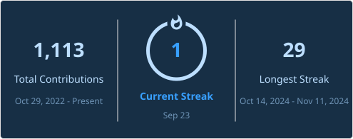

---

### About

Year 4 Computer Science student at the National University of Singapore, specialising in Software Engineering with a Minor in Psychology.

I like keeping up with new tech and software trends, and building and experimenting with them to try out new ideas.

---

### Some stuff I have done

-  **Beanchillin** — University forum web app for NUS Orbital 2024
-  **SQLancer Benchmarking Platform** — Web platform to benchmark SQLancer, an automated database testing tool, against custom metrics

---

### Tech stack

**Languages**  
     

**Frontend**  
  

**Backend & data**  
       

**Deployment**  
 

---

### Activity

---

<!--
SETUP NOTES (delete before committing if you like)

1. hero.svg lives in the root of your yong-zhuo/yong-zhuo repo, next to this
   README. Edit the text directly inside it. Colours: #EEF6F3 headline,
   #8FE6CD mint accent, #7EA9C4 steel blue, #3D6270 faint, #0A1114 screen.

2. The streak card is generated by .github/workflows/streak-stats.yml
   (theme=prussian) and committed to profile/streak.svg instead of
   hotlinking streak-stats.demolab.com. Its push trigger fires on any
   branch and re-runs whenever the workflow file is edited; the daily
   cron keeps it fresh after that.

3. The languages card next to it hits github-stats-extended.vercel.app
   (an actively maintained fork of github-readme-stats) directly, no
   workflow needed. If it ever goes down, self-host it same as note 2.

4. Shields logo slugs come from simple-icons. If a badge renders without an
   icon the slug changed. Look it up at simpleicons.org and update logo=.
-->
